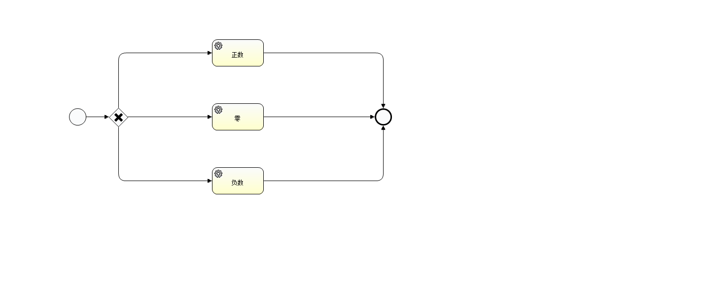
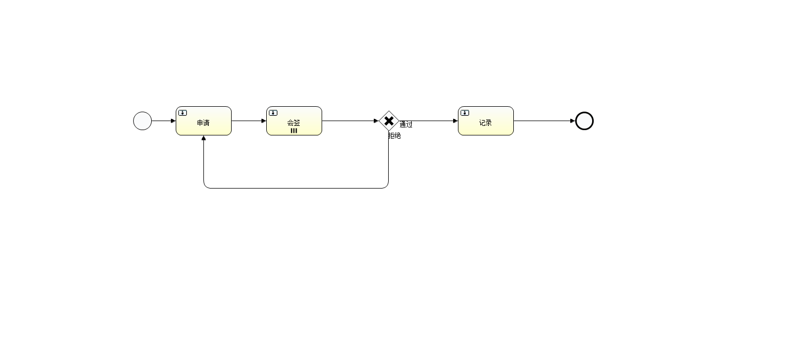

# Activiti7 + SpringBoot2

#### 介绍
springboot2集成activiti7实现的简单工作流，修改application.properties数据库配置即可启动

---

##### 流程图介绍
>claim-expense
* 简单报销审批流程

>exclusive-gateway
* 排他网关学习

>listener
* 执行监听和任务监听

>countersign
* 会签
